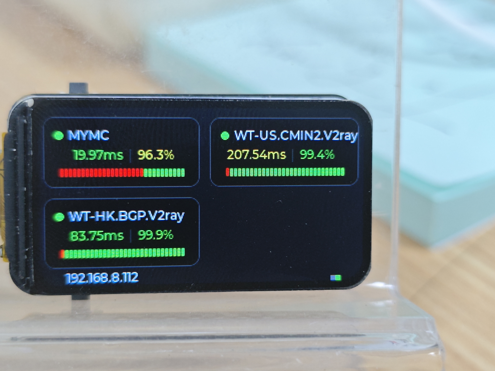
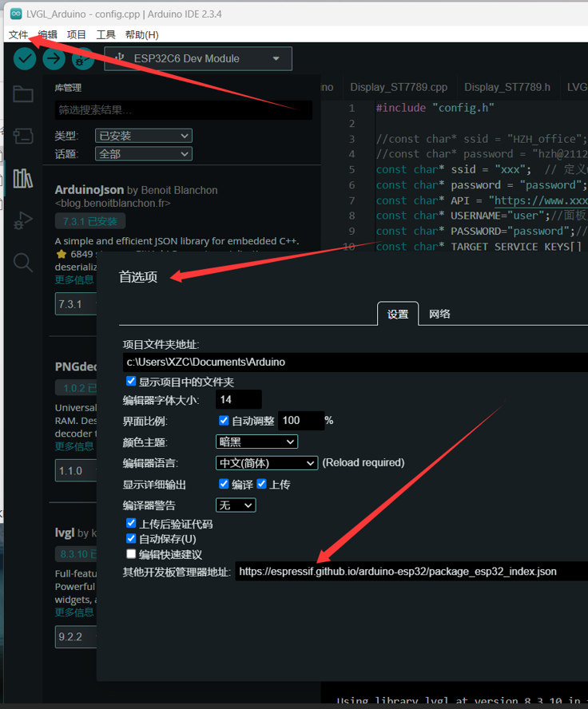
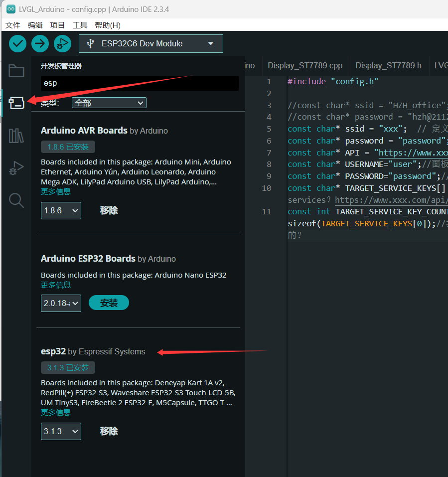
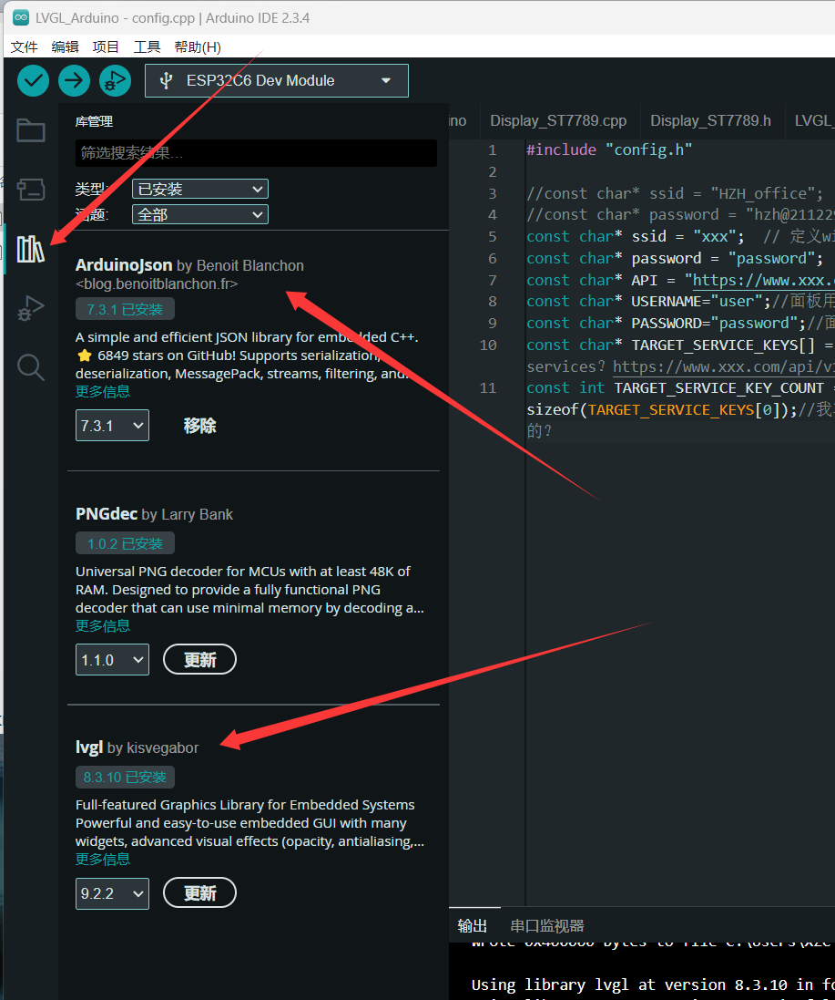
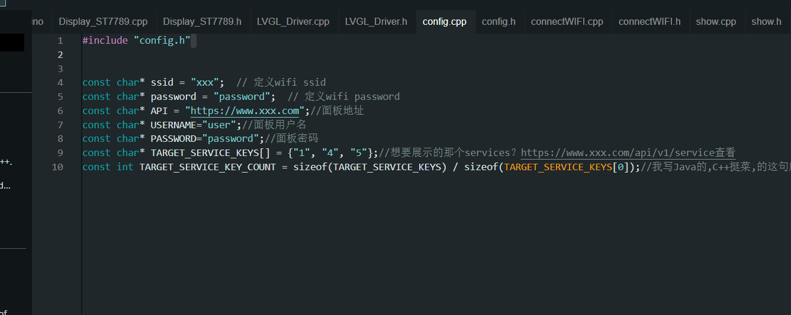
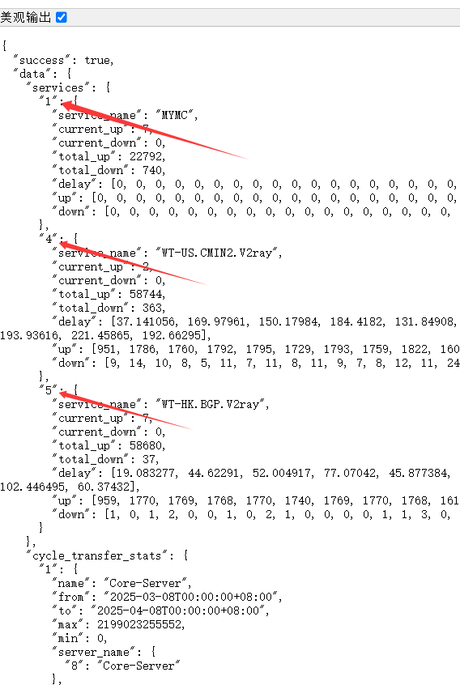
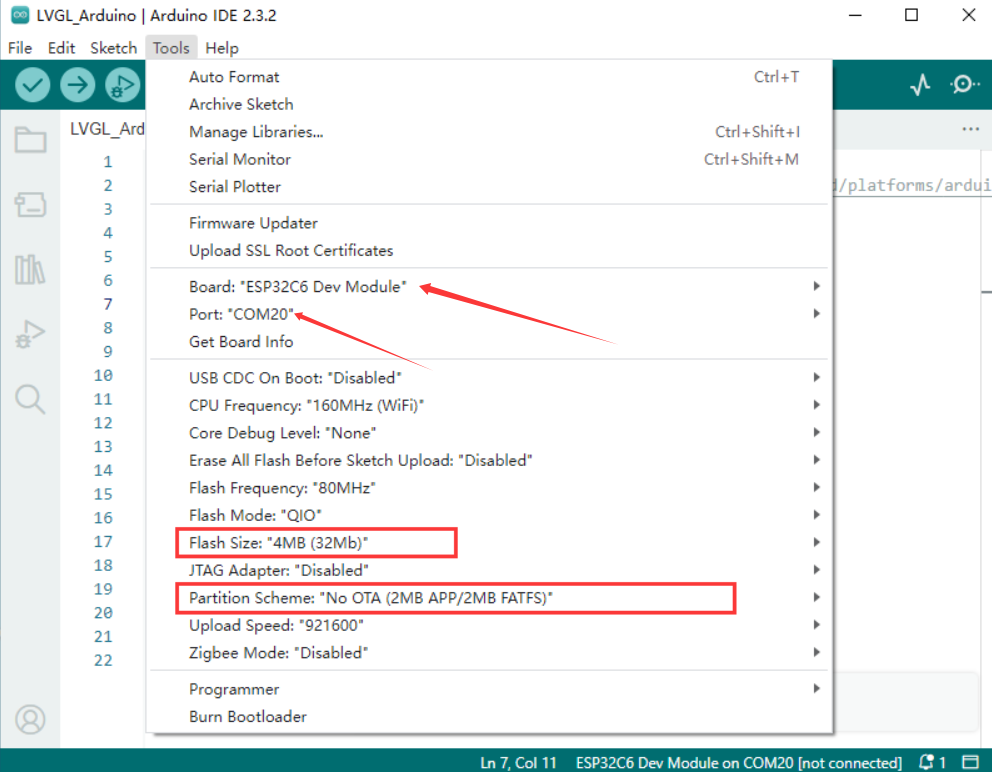

# 基于Nezha的services状态显示器
## 前言
> 这个项目只是一时兴起想弄个玩具玩玩，有能力的欢迎贡献PR，毕竟在我看来还可以多写一些功能。
> 
>之前也弄过基于AIDA64的这种屏幕，不过OLED的颗粒很大，效果很勉强，这个ESP32-C6-1.47
>分辨率很高，但是屏幕太小了，或许这是一个错误
>
> 这个项目只适用于Nezha v1

## 先上图

# 硬件资料

https://www.waveshare.net/wiki/ESP32-C6-LCD-1.47#.E8.B5.84.E6.96.99

# 软件
## 数据信息来源 Nezha的API
据我实践services好像是不用认证的，谁都可以拿到，server就不行需要认证

不过我还是写了认证，以防后面Nezha后面更新堵上了这个漏洞？

想抓取server数据也可以，我已经抓取过了，那条代码被我注释了，可以自己更改，不过ui和数据处理就需要自己写了。

servicesAPI地址：https://www.xxx.com/api/v1/service

serverAPI地址：https://www.xxx.com/api/v1/server

替换成自己的面板地址即可，如果看不到登录下

## 说明
UI界面绘制 LVGL 全靠AI搓的

细心的小伙伴会发现面板上的service监控的在线状态总是会慢几个小时，我这边重新写了一下判断掉线的逻辑，也就是屏幕上服务器名称前面那个绿色的点，只要有服务器get到了数据状态上立马就会显示上线，同样的如果有任何一个服务器get到了离线，状态就会立马显示离线。

下面30个像素点显示30天内服务器在线情况，延时显示的是当天的平均延时。

## 0. 硬件购买
淘宝66块，直接搜索微雪ESP32-C6-1.47

## 2. 开发环境搭建
1. 下载Arduino
2. 配置库https://espressif.github.io/arduino-esp32/package_esp32_index.json

   
4.下载库，可能要科学，这个自己解决

|  |  |
| -------------------------------------------------------- | -------------------------------------------------------- |

6. 下载或者Clone 代码，然后在Arduino左上角选择文件->打开，选择ino文件即可打开项目

## 3. 修改代码配置
代码很简单，只有一个文件，应该很容易看得懂

- config.cpp 配置文件
  配置WiFi和面板地址还有密码

特别说明下，这个服务器的标识需要在api里面看

servicesAPI地址：https://www.xxx.com/api/v1/service

这里就是对应的服务器标识

> 个人比较懒，自动配置的功能不太想写，你就说能不能用吧，所以有能力的小伙伴可以改代码定制自己的

## 编译并烧录
1. USB连接上开发板
2. 配置一下开发板信息

  
4. 点击左上角的✓即可

# FAQ

## 有问题？
有问题看串口输出，如果串口没有输出开启左上角工具里的USB CDC重启Arduino
